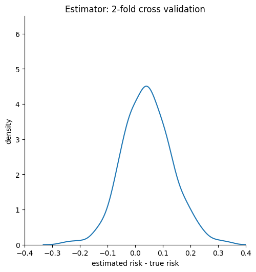
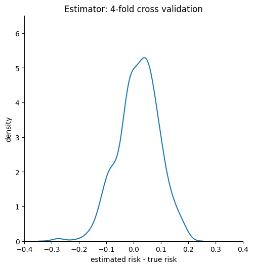
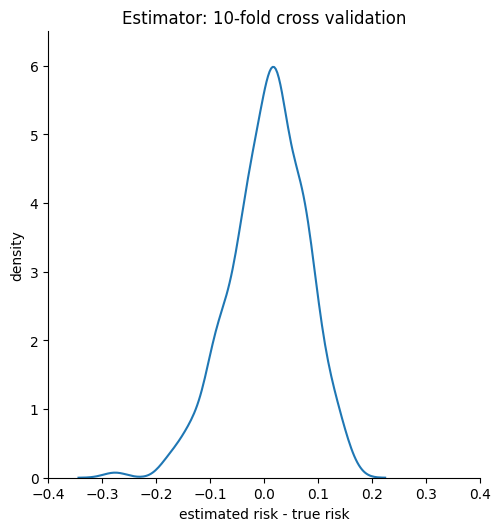
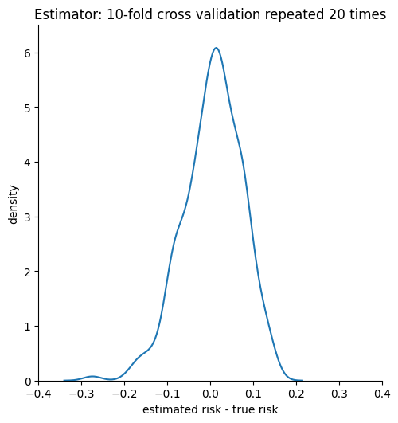

# 1. Holdout esimation

## 1a. Model loss estimator variability due to test data variability

```terminal
True risk proxy:            0.4853179137034272
Mean difference:            0.0006116347890765461
0.5-0.5 baseline true risk: 0.63987
Median standard error:      0.0592037075653488
Percentage of 95CI that contain the true risk proxy: 93.1
```


## 1b. Overestimation of the deployed model’s risk

```terminal
Minimum:       -0.0349
1st Quantile:   0.0133
Median:         0.0322      
Mean:           0.0381        
3rd Quantile:   0.0666
Maximum:        0.1265  
```

## 1c. Loss estimator variability due to split variability

```terminal
True risk proxy:        0.49327586624666814
Mean difference:        0.012320939517978786
Median standard error:  0.09856077639318081
Percentage of 95CI that contain the true risk proxy: 97.8
```


# 2. Cross validation

```terminal
----------------------------------------
Estimator: 2-fold cross validation
Mean difference:                                0.043818096438358975
Median standard error:                          0.00373166711353565
Confidence interval contains true risk proxy:   82.4%
----------------------------------------
Estimator: leave-one-out cross validation
Mean difference:                                0.0017088016126511135
Median standard error:                          0.002670678543788642
Confidence interval contains true risk proxy:   91.2%
----------------------------------------
Estimator: 10-fold cross validation
Mean difference:                                0.006852598530402844
Median standard error:                          0.0027605190670414873
Confidence interval contains true risk proxy:   90.0%
----------------------------------------
Estimator: 4-fold cross validation
Mean difference:                                0.017415031988331785
Median standard error:                          0.0029987166808169425
Confidence interval contains true risk proxy:   87.6%
----------------------------------------
Estimator: 10-fold cross validation repeated 20 times
Mean difference:                                0.0060634163417708125
Median standard error:                          0.002681546466388107
Confidence interval contains true risk proxy:   32.0%
```





